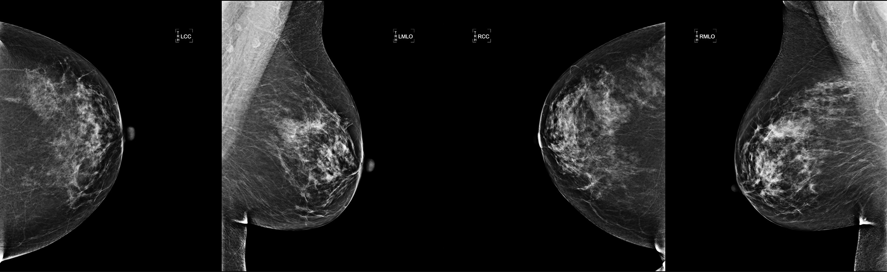
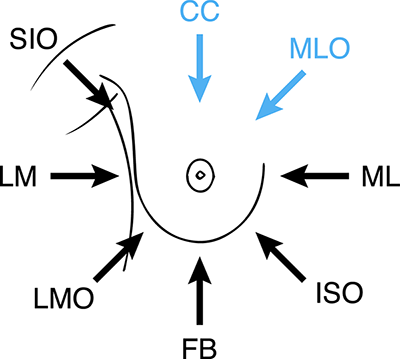

# The Digital Mammography DREAM Challenge

https://www.synapse.org/#!Synapse:syn4224222/wiki/401759

> Out of every 1000 women screened, only 5 will have breast cancer (0.5%). But 100 (10%) will be recalled for further testing

## Challenge
Mammography is associated with a high risk of false positive testing, so we need to **build a model to help reduce the recall rate** of breast cancer screening

The algorithms will analyze the mammography exams (and clinical information, depending on the sub-challenge) and interpret them as to whether the subject has breast cancer or not, and in which breast.

### Sub-challenge 1
* Input: A screening mammography exam (only) consisting of several images of both breasts.
* Output: Score Left and score Right (between 0 and 1) indicate the likelihood that the subject was tissue-diagnosed with cancer within one year from the given screening exam

### Sub-challenge 2
* Input: A screening mammography exam, previous screening exams of the same subject, clinical/demographic information such as race, age and family history of breast cancer.
* Output: Score Left and score Right (the same with sub-challenge 1)

A mammography exam typically contains **4 images** corresponding to **2 views** of each breast:
1. Craniocaudal (CC)
2. Mediolateral oblique (MLO)

> However in some cases there may be more than 4 images per exam, including views different from CC and MLO.

*Four typical mammography images: (left to right) CC left, MLO left, CC right, MLO right*

*Position of the X-Ray Beam*

## Dataset

Group Health (https://ghc.org) has generously provided de-identified digital mammography exams for more than 86k subjects, representing over 640k mammography images. **However**, for this challenge only **500 mammography images from 58 subjects** (cancer positive and negative) and **clinical information for 111 exams**

Mammography images details:
* **DICOM** format (.dcm)
* The DICOM **header** contains technical as well as clinical information
* Various sizes from **3328x2560** to **5928x4728** pixels.

Files:
* images_crosswalk_pilot_20160906.tsv : reference to mammography **images filename** with **subject id, exam id, class (cancer or not)** .etc (excluding clinical information)
* exams_metadata_pilot_20160906.tsv : meta data (clinical information) for each subject id

## Prediction Scoring

**Primary: Area Under the Receiver Operating Characteristics Curve (AUROC)**
Petrick N, et. al., *Evaluation of computer-aided detection and diagnosis systems*, Med Phys 40 (8): 087001 (2013).

* The average value of sensitivity over all possible values of specificity
* A measure of how well the algorithm’s continuous score separates true positive from false positive

** Secondary metric: Partial Area Under the Receiver Operating Characteristics Curve (pAUROC)**
McClish DK, *Analyzing a portion of the ROC curve*, Med Decis Making. Jul-Sep; 9 (3): 190-5 (1989);
Ma H, Bandos AI, Rockette HE, Gur D., *On use of partial area under the ROC curve for evaluation of diagnostic performance*, Stat Med. Sep 10; 32 (20): 3449-58 (2013)

* Emphasizes a specific region of the ROC (reducing the False Positive rate (i.e., increase specificity) without decreasing the True Positive rate (sensitivity))

## Submitting Models

Your trainable model is submitted in the form of a Docker image  https://docs.docker.com

> To submit models, user need to be synapse-certified by passing a short quiz (approximately 20 minutes)

 Models will run on a servers powered by NVIDIA Tesla K80-based GPUs. Each running model will have access to:
 * 24 CPU cores
 * one Tesla K-80 (2 Kepler GK210 GPUs)
 * 200GB of RAM
 * 10 TB of local storage (eg. for preprocessing)

> You are allotted **336 hours (14 days)** of server time **in each five week** challenge round for preprocessing data and/or training models for scoring

## Programming references
* Python PyDICOM http://pydicom.readthedocs.io/en/stable/pydicom_user_guide.html
* Example of machine learning with DICOM (ID3 and SVM) https://github.com/slowvak/MachineLearningForMedicalImages
* Docker python submission example https://github.com/brucehoff/dm-python-example
